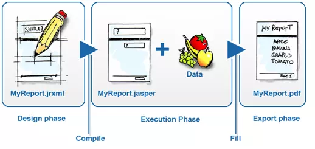
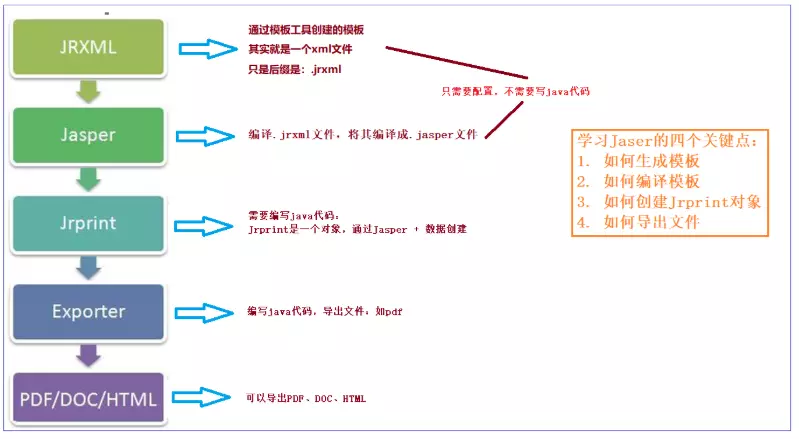
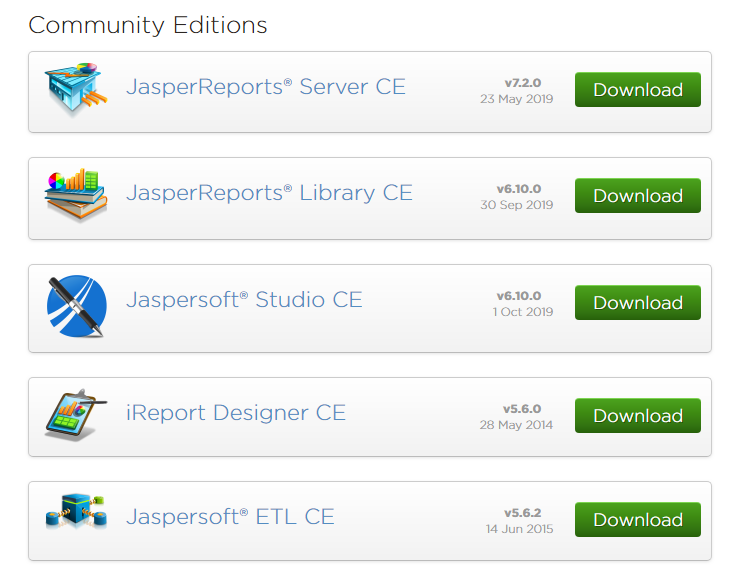
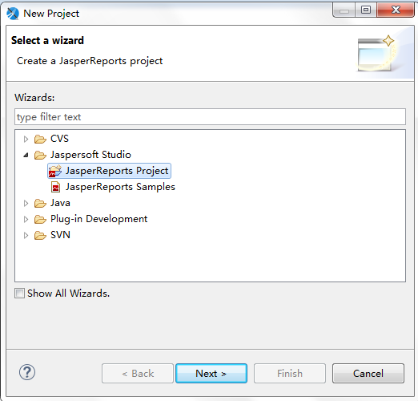
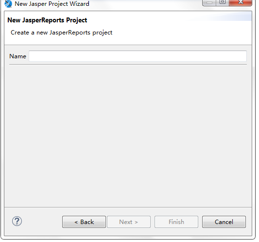
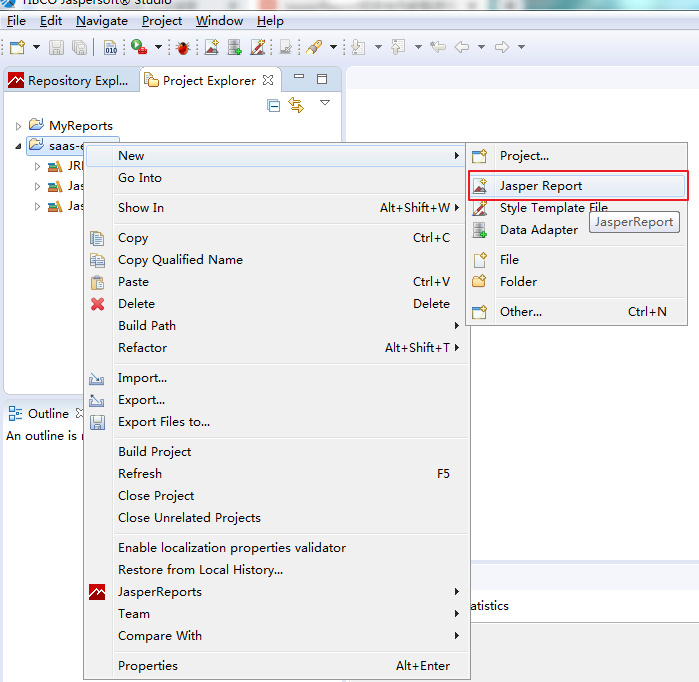
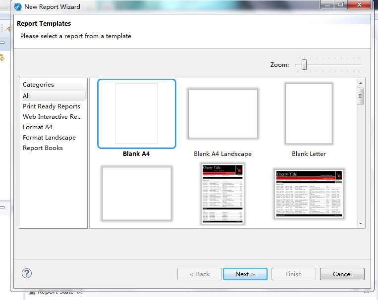
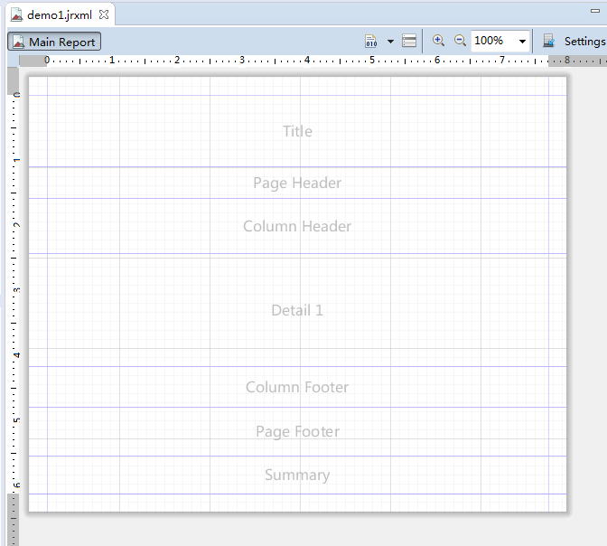
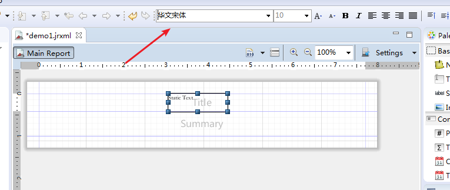
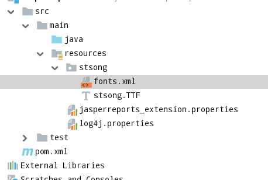

# PDF制作

```
Jasper Report：是一个强大、灵活的报表生成工具，能够展示丰富的页面内容，并将之转换成 PDF
```

## JasperReport框架的介绍

### 生命周期



- 设计阶段（Design）：<font color=red>定义模板</font>
  所谓的报表设计就是创建一些模板，模板包含了报表的布局与设计，包括执行计算的复杂公式、可选的从数据源获取数据的查询语句、以及其它的一些信息。模板设计完成之后，我们将模板保存为JRXML文件（JR代表JasperReports）,其实就是一个XML文件。
- 执行阶段（Execution）：<font color=red>模板 + 数据</font>
  使用以JRXML文件编译为可执行的二进制文件（即.Jasper文件）结合数据进行执行，填充报表数据
- 输出阶段（Export）：<font color=red>展示。 将模板和数据一起展示。</font>
  数据填充结束，可以指定输出为多种形式的报表

### 执行流程



```
1.JRXML:报表填充模板，本质是一个XML.
	JasperReport已经封装了一个dtd，只要按照规定的格式写这个xml文件，那么jasperReport就可以将其解析最终生成报表，但是jasperReport所解析的不是我们常见的.xml文件，而是.jrxml文件，其实跟xml是一样的，只是后缀不一样。
	
2.Jasper:由JRXML模板编译生成的二进制文件，用于代码填充数据。
	解析完成后JasperReport就开始编译.jrxml文件，将其编译成.jasper文件，因为JasperReport只对.jasper文件进行填充数据和转换，这步操作就跟我们java中将java文件编译成class文件是一样的.

3.Jrprint:当用数据填充完Jasper后生成的文件，用于输出报表。
	这一步才是JasperReport的核心所在，它会根据你在xml里面写好的查询语句来查询指定是数据库，也可以控制在后台编写查询语句，参数，数据库。在报表填充完后，会再生成一个.jrprint格式的文件（读取jasper文件进行填充，然后生成一个jrprint文件）
	
4.Exporter:决定要输出的报表为何种格式，报表输出的管理类。
5.Jasperreport 可以输出多种格式的报表文件，常见的有Html,PDF,xls等
```

## Jaspersoft Studio 模板工具

官网下载 Jaspersoft Studio：https://community.jaspersoft.com/community-download



### 基本使用

#### 创建模板

```
打开Jaspersoft Studio ，新建一个project, 步骤： File -> New -> Project-> JasperReports Project
```



```
下一步，输入项目名称：
```



```
创建JasperReport模板
```





#### 面板说明



```
* Title(标题)：只在整个报表的第一页的最上端显示。只在第一页显示，其他页面均不显示。
* Page Header(页头)：在整个报表中每一页都会显示。在第一页中，出现的位置在 Title Band的下面。在除了第一页的其他页面中Page Header 的内容均在页面的最上端显示。

* Page Footer(页脚)：在整个报表中每一页都会显示。显示在页面的最下端。一般用来显示页码。
* Detail 1(详细)：报表内容，每一页都会显示。
* Column Header(列头)：Detail中打印的是一张表的话，这Column Header就是表中列的列头。
* Column Footer(列脚)：Detail中打印的是一张表的话，这Column Footer就是表中列的列脚
* Summary(统计)：表格的合计段，出现在整个报表的最后一页中，在Detail 1 Band后面。主要是用来做报表的合计显示。
```

## 整合工程

1. 导入坐标

```xml
<dependency>
    <groupId>net.sf.jasperreports</groupId> 
    <artifactId>jasperreports</artifactId>
    <version>6.5.0</version>
</dependency>
<dependency> 
    <groupId>org.olap4j</groupId> 
    <artifactId>olap4j</artifactId>
    <version>1.2.0</version>
</dependency>
<dependency> 
    <groupId>com.lowagie</groupId> 
    <artifactId>itext</artifactId> 
    <version>2.1.7</version>
</dependency>
```

2. 引入模板

```
 将编译好的模板引入到当前工程中  test.jasper
```

3.  配置控制器方法

```java
@Controller
public class JasperController {
@RequestMapping("/test")	
    public void test(HttpServletResponse response, HttpSession session) throws Exception {
        //1.加载模板文件
        String path = session.getServletContext().getRealPath("/")+"/jasper/test.jasper";
        //2.构建文件输入流
        FileInputStream fis = new FileInputStream(path);
        //3.创建 JasperPrint 对象
        JasperPrint jp = JasperFillManager.fillReport(fis,new HashMap<>(),new 
                                                      JREmptyDataSource());
        //4.写入 pdf 文档输出
        JasperExportManager.exportReportToPdfStream(jp,response.getOutputStream()); 
	} 
}
```

### 中文处理

1. 设计阶段需要指定中文样式



2. 通过手动指定中文字体的形式解决中文

   <!--添加properties文件：-->

```properties
net.sf.jasperreports.extension.registry.factory.simple.font.families=
net.sf.jasperreports.engine.fonts.SimpleFontExtensionsRegistryFactory
net.sf.jasperreports.extension.simple.font.families.lobstertwo=stsong/fonts.xml
```

​		<!--指定中文配置文件-->

```xml
<?xml version="1.0" encoding="UTF-8"?>
<fontFamilies>
    <!--<fontFamily name="Lobster Two">-->
    <!--<normal>lobstertwo/LobsterTwo-Regular.otf</normal>-->
    <!--<bold>lobstertwo/LobsterTwo-Bold.otf</bold>-->
    <!--<italic>lobstertwo/LobsterTwo-Italic.otf</italic>-->
    <!--<boldItalic>lobstertwo/LobsterTwo-BoldItalic.otf</boldItalic>-->
    <!--<pdfEncoding>Identity-H</pdfEncoding>-->
    <!--<pdfEmbedded>true</pdfEmbedded>-->
    <!--<!–-->
    <!--<exportFonts>-->
    <!--<export key="net.sf.jasperreports.html">'Lobster Two', 'Times New Roman', Times, serif</export>-->
    <!--</exportFonts>-->
    <!--–>-->
    <!--</fontFamily>-->
    <fontFamily name="华文宋体">
        <normal>stsong/stsong.TTF</normal>
        <bold>stsong/stsong.TTF</bold>
        <italic>stsong/stsong.TTF</italic>
        <boldItalic>stsong/stsong.TTF</boldItalic>
        <pdfEncoding>Identity-H</pdfEncoding>
        <pdfEmbedded>true</pdfEmbedded>
        <exportFonts>
            <export key="net.sf.jasperreports.html">'华文宋体', Arial, Helvetica, sans-serif</export>
            <export key="net.sf.jasperreports.xhtml">'华文宋体', Arial, Helvetica, sans-serif</export>
        </exportFonts>
        <!--
        <locales>
            <locale>en_US</locale>
            <locale>de_DE</locale>
        </locales>
        -->
    </fontFamily>
</fontFamilies>
```

<!--引入字体库-->

stsong.TTF



